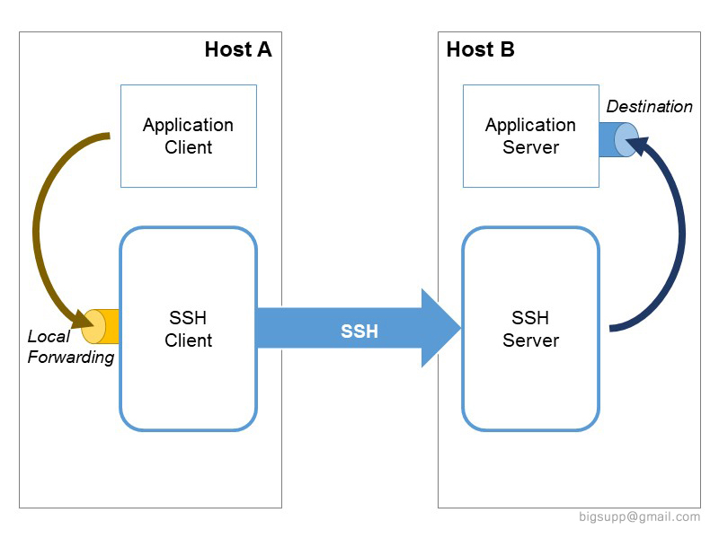

# pymongo-ssh-tunnel

Example of PyMongo Connection via SSH Tunnel

## Python modules:
- [sshtunnel](https://pypi.org/project/sshtunnel/) SSHTunnel
  - Pure python SSH tunnels
- [pymongo](https://pypi.org/project/pymongo/) PyMongo
  - Python driver for [MongoDB](http://www.mongodb.org)
- [tunnel-ssh](https://www.npmjs.com/package/ssh-tunnel) SSH Tunnel management utility

## SSH Tunneling Local Forwarding - Logical Diagram
